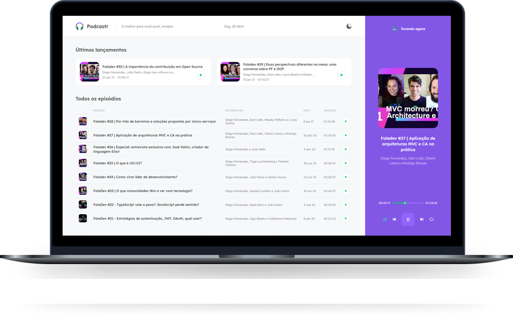
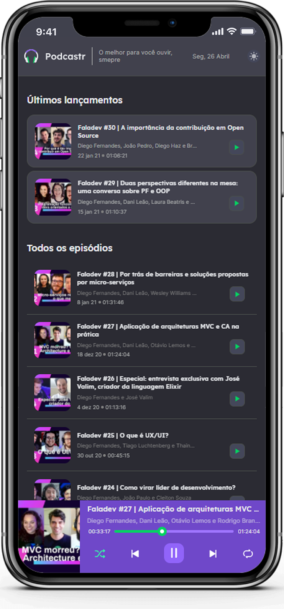

<h1 align="center">
  
</h1>

  

## About
Podcastr is a podcast player that aggregates all episodes in one place and highlights the latest releases. Each episode has an exclusive page with detailed information about the members and the topic covered.

## Implemented by me:

- Dark theme
- Responsive layout

  

## Technologies
This project was developed with the following technologies:

- HTML
- SCSS
- JavaScript
- TypeScript
- NextJS
- ReactJS

---

<strong>The original project was designed by Rocketseat team for the ReactJS path at the NLW#5 event.</strong>
